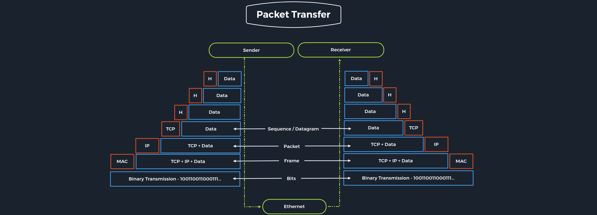

# Introduction to Networking

## Networking Overview

A network enables two computers to communicate with each other. There is a wide array of topologies (mesh/tree/star), mediums (ethernet/fiber/coax/wireless), and protocols (TCP/UDP/IPX) that can be used to facilitate the network. It is important for security professionals to understand networking because when the network fails, the error may be silent, causing us to miss something.

Setting up a large, flat network is not extremely difficult, and it can be a reliable network, at least operationally. However, a flat network is like building a house on a land plot and considering it secure because it has a lock on the door. By creating lots of smaller networks and having them communicate, we can add defense layers. Pivoting around a network is not difficult, but doing it quickly and silently is tough and will slow attackers down.

### Basic Information

Let us look at the following high-level diagram of how a Work From Home setup may work.

The entire internet is based on many subdivided networks, as shown in the example and marked as "Home Network" and "Company Network." We can imagine networking as the delivery of mail or packages sent by one computer and received by another.

Suppose we want to visit a company's website from our "Home Network." In that case, we exchange data with the company's website located in their "Company Network." As with sending mail or packets, we know the address where the packets should go. The website address or Uniform Resource Locator (URL) which we enter into our browser is also known as Fully Qualified Domain Name (FQDN).

The difference between URLs and FQDNs is that:

- An FQDN (e.g., `www.hackthebox.eu`) only specifies the address of the "building."
- A URL (e.g., `https://www.hackthebox.eu/example?floor=2&office=dev&employee=17`) also specifies the "floor," "office," "mailbox," and the corresponding "employee" for whom the package is intended.

We will discuss the exact representations and definitions more clearly and precisely in other sections.

The fact is that we know the address, but not the exact geographical location of the address. In this situation, the post office can determine the exact location, which then forwards the packets to the desired location. Therefore, our post office forwards our packets to the main post office, representing our Internet Service Provider (ISP).

Our post office is our router, which we utilize to connect to the "Internet" in networking.

As soon as we send our packet through our post office (router), the packet is forwarded to the main post office (ISP). This main post office looks in the address register/phonebook (Domain Name Service) where this address is located and returns the corresponding geographical coordinates (IP address). Now that we know the address's exact location, our packet is sent directly there by a direct flight via our main post office.

After the web server has received our packet with the request for their website, the web server sends us back the packet with the data for the presentation of the website via the post office (router) of the "Company Network" to the specified return address (our IP address).

## Extra Points

In the high-level diagram, ideally, the company network would consist of five separate networks to enhance security and manageability. Here's a breakdown of the suggested network segmentation:

1. **DMZ (Demilitarized Zone)**
   - **Purpose**: The Web Server should be placed in a DMZ. The DMZ is a separate network that acts as a buffer between the public internet and the internal network. Since clients on the internet can initiate communications with the website, the web server is more exposed and likely to be compromised. By isolating it in a DMZ, administrators can implement additional security measures and networking protections to safeguard the rest of the network from potential threats.

2. **Workstations**
   - **Purpose**: Workstations should be on their own network. Ideally, each workstation should have a Host-Based Firewall rule to prevent it from communicating with other workstations. This setup reduces the risk of attacks like spoofing or man-in-the-middle attacks, which become more concerning if workstations share the same network with servers.

3. **Administration Network**
   - **Purpose**: The Switch and Router should be on an "Administration Network." This network is dedicated to administrative tasks and management of network devices. By separating administration traffic from other types of network traffic, you prevent workstations from snooping on or interfering with communication between these devices. For instance, I've often observed OSPF (Open Shortest Path First) advertisements during penetration tests. Without a trusted network for administrative tasks, anyone on the internal network could potentially send malicious advertisements and perform man-in-the-middle attacks.

4. **IP Phones**
   - **Purpose**: IP Phones should be on their own network. This segmentation is crucial for both security and performance reasons. By isolating IP phones, you prevent computers from eavesdropping on phone communications. Additionally, IP phones are sensitive to latency, so having a dedicated network allows administrators to prioritize voice traffic and minimize lag.

5. **Printers**
   - **Purpose**: Printers should be on their own network as well. While it may seem unusual, printers are notoriously difficult to secure. For example, Windows operating systems might perform NTLMv2 authentication during print jobs, which can lead to password theft. Furthermore, printers often handle sensitive information and can be a target for persistence attacks. Isolating them on a separate network helps mitigate these risks.

By following these practices, you can enhance network security, performance, and manageability, providing a more robust defense against potential threats and ensuring efficient operation of network resources.

- Internet VS Intranet VS Extranet
The internet is a public network accessible to anyone, while intranets are private networks accessible only to authorized users within an organization. Extranets are private networks that allow external parties to access certain parts of an organization's intranet.

## Network Types

Each network is structured differently and can be set up individually. For this reason, various types and topologies have been developed to categorize these networks. Understanding network types can be overwhelming due to the vast range of terminologies, some of which include geographical aspects. While some terms may not be frequently used in practice, they are still valuable to know, especially for specific scenarios or exams. This section will cover Common Terms and Book Terms. 

### Common Terminology

| Network Type                   | Definition                                          |
|-------------------------------|-----------------------------------------------------|
| **Wide Area Network (WAN)**   | The Internet; connects multiple LANs over large distances. |
| **Local Area Network (LAN)**  | Internal networks within a limited area, such as a home or office. |
| **Wireless Local Area Network (WLAN)** | Internal networks that are accessible over Wi-Fi. |
| **Virtual Private Network (VPN)** | Connects multiple network sites to create a single, secure LAN over the internet. |

### Book Terms

Book terms can be useful for understanding specific network concepts and are sometimes referenced in networking literature and exams. While they might not come up in everyday use, they can be critical in certain technical situations. For example, knowing these terms could be important if you encounter rare issues, such as an email server failing to deliver emails beyond a specific geographical distance.

**Note**: Don't feel pressured to memorize all book terms unless you're preparing for a networking certification or exam. Understanding the common terminology is usually sufficient for practical purposes.

## Network Types

Each network type is structured differently and serves distinct purposes. Understanding these types helps in managing and securing networks effectively. Below are the common and book terms related to different network types.

### WAN (Wide Area Network)

The WAN, commonly referred to as The Internet, is a network that covers a large geographic area, connecting multiple LANs (Local Area Networks). Here are key points about WANs:

- **WAN Address**: The address accessible over the Internet.
- **Internal WAN**: Large organizations or government agencies might have their own WAN, also known as an Intranet or Airgap Network.
- **Identification**: WANs are identified using WAN-specific routing protocols like BGP (Border Gateway Protocol) and IP addresses that fall outside the RFC 1918 range (10.0.0.0/8, 172.16.0.0/12, 192.168.0.0/16).

### LAN / WLAN (Local Area Network / Wireless Local Area Network)

LANs and WLANs are networks that serve internal communications within a limited area, like a home or office:

- **LAN**: Uses IP addresses designated for local use (RFC 1918 addresses). It is a wired network that connects devices within a limited area.
- **WLAN**: Similar to a LAN but uses wireless communication, allowing devices to connect without cables. The main difference is the medium of connection, with WLAN introducing wireless data transmission.

### VPN (Virtual Private Network)

VPNs create secure connections over potentially unsecured networks (like the Internet) to make remote devices appear as if they are part of a local network. There are three main types of VPNs:

1. **Site-To-Site VPN**
   - **Description**: Connects entire networks together, such as branch offices of a company over the Internet, making them function as if they are part of the same local network.
   - **Devices**: Typically involves network devices like routers or firewalls.

2. **Remote Access VPN**
   - **Description**: Allows individual users to connect securely to a network from a remote location. It creates a virtual interface on the client’s device that acts as if it is part of the network.
   - **Example**: Hack The Box uses OpenVPN to create a TUN Adapter for accessing labs.
   - **Split-Tunnel VPN**: Routes only specific network traffic through the VPN, leaving other internet traffic unaffected. This is useful for accessing lab environments while preserving normal internet usage. However, it can be less secure for corporate environments due to potential malware risks.

3. **SSL VPN**
   - **Description**: Operates within a web browser and is increasingly common. It streams applications or entire desktop sessions to the browser.
   - **Example**: Hack The Box Pwnbox is accessed through an SSL VPN.

### Book Terms

These terms provide a broader understanding of network types, although they may not be frequently encountered in everyday practice:

| Network Type                    | Definition                                                   |
|--------------------------------|--------------------------------------------------------------|
| **Global Area Network (GAN)**  | A worldwide network such as the Internet, spanning multiple WANs and connecting global networks via undersea cables or satellites. |
| **Metropolitan Area Network (MAN)** | A broadband network connecting several LANs within a geographical area, such as a city. It provides high-performance connections and can be integrated into WANs and GANs. |
| **Wireless Personal Area Network (WPAN)** | A personal network with a limited range, typically using Bluetooth or Wireless USB. A Bluetooth-based WPAN is known as a Piconet. Used for low-data-rate communication in IoT applications. |

### PAN / WPAN (Personal Area Network / Wireless Personal Area Network)

- **PAN**: A wired network that connects devices over a short range, usually within a single room.
- **WPAN**: A wireless version of a PAN, utilizing technologies like Bluetooth or Wireless USB. It is suitable for connecting devices within a few meters and is used in IoT applications for smart home and automation tasks.

By understanding these network types and their characteristics, you can better manage network infrastructure and address specific needs related to connectivity and security.

# MISC: CDN vs Proxy vs Load Balancer vs POP

## What is a CDN (Content Delivery Network)?

A CDN is a system of distributed servers that delivers web content (like images and videos) to users based on their geographic location. It speeds up access to content and reduces the load on the origin server by caching copies of the content at multiple locations.

## What is a Proxy?

A proxy server acts as an intermediary between a client and the internet. It can cache content to improve load times, filter requests to enhance security, and provide anonymity for users by masking their IP addresses.

## What is a Load Balancer?

A load balancer distributes incoming network or application traffic across multiple servers to ensure no single server becomes overwhelmed. This improves performance, reliability, and helps in managing high volumes of traffic by balancing the load.

## What is a POP (Point of Presence)?

A POP is a physical location where a network connects to other networks or where a CDN has servers to deliver content. It helps reduce latency and improve performance by bringing content closer to users.

# Network Topologies

## Point-to-Point

The simplest network topology with a dedicated connection between two hosts is the point-to-point topology. In this topology, a direct and straightforward physical link exists only between two hosts. These two devices can use these connections for mutual communication.

**Note:** Point-to-point topologies are the basic model of traditional telephony and must not be confused with P2P (Peer-to-Peer architecture).

## Bus

All hosts are connected via a transmission medium in the bus topology. Every host has access to the transmission medium and the signals that are transmitted over it. There is no central network component that controls the processes on it. The transmission medium for this can be, for example, a coaxial cable.

Since the medium is shared with all the others, only one host can send, and all the others can only receive and evaluate the data and see whether it is intended for itself.

## Star

The star topology is a network component that maintains a connection to all hosts. Each host is connected to the central network component via a separate link. This is usually a router, a hub, or a switch. These handle the forwarding function for the data packets. To do this, the data packets are received and forwarded to the destination. The data traffic on the central network component can be very high since all data and connections go through it.

## Ring

The physical ring topology is such that each host or node is connected to the ring with two cables:

- One for the incoming signals
- Another for the outgoing ones

This means that one cable arrives at each host and one cable leaves. The ring topology typically does not require an active network component. The control and access to the transmission medium are regulated by a protocol to which all stations adhere.

A logical ring topology is based on a physical star topology, where a distributor at the node simulates the ring by forwarding from one port to the next.

The information is transmitted in a predetermined transmission direction. Typically, the transmission medium is accessed sequentially from station to station using a retrieval system from the central station or a token. A token is a bit pattern that continually passes through a ring network in one direction, which works according to the claim token process.

## Mesh

Many nodes decide about the connections on a physical level and the routing on a logical level in meshed networks. Therefore, meshed structures have no fixed topology. There are two basic structures from the basic concept: the fully meshed and the partially meshed structure.

### Fully Meshed

Each host is connected to every other host in the network in a fully meshed structure. This means that the hosts are meshed with each other. This technique is primarily used in WAN or MAN to ensure high reliability and bandwidth.

In this setup, important network nodes such as routers could be networked together. If one router fails, the others can continue to work without problems, and the network can absorb the failure due to the many connections.

Each node of a fully meshed topology has the same routing functions and knows the neighboring nodes it can communicate with proximity to the network gateway and traffic loads.

### Partially Meshed

In the partially meshed structure, the endpoints are connected by only one connection. In this type of network topology, specific nodes are connected to exactly one other node, and some other nodes are connected to two or more other nodes with a point-to-point connection.

## Tree

The tree topology is an extended star topology that more extensive local networks have in this structure. This is especially useful when several topologies are combined. This topology is often used, for example, in larger company buildings.

There are both logical tree structures according to the spanning tree and physical ones. Modular modern networks, based on structured cabling with a hub hierarchy, also have a tree structure. Tree topologies are also used for broadband networks and city networks (MAN).

## Hybrid

Hybrid networks combine two or more topologies so that the resulting network does not present any standard topologies. For example, a tree network can represent a hybrid topology in which star networks are connected via interconnected bus networks. However, a tree network that is linked to another tree network is still topologically a tree network. A hybrid topology is always created when two different basic network topologies are interconnected.

## Daisy Chain

In the daisy chain topology, multiple hosts are connected by placing a cable from one node to another.

Since this creates a chain of connections, it is also known as a daisy-chain configuration in which multiple hardware components are connected in a series. This type of networking is often found in automation technology (CAN).

Daisy chaining is based on the physical arrangement of the nodes, in contrast to token procedures, which are structural but can be made independent of the physical layout. The signal is sent to and from a component via its previous nodes to the computer system.

# Proxies

Many people have different opinions on what a proxy is:

- **Security Professionals** might think of HTTP Proxies (e.g., BurpSuite) or pivoting with SOCKS/SSH Proxies (e.g., Chisel, ptunnel, sshuttle).
- **Web Developers** use proxies like Cloudflare or ModSecurity to block malicious traffic.
- **Average Users** might see a proxy as a tool to obfuscate their location and access content from another country.
- **Law Enforcement** might associate proxies with illegal activities.

Not all these examples are correct. A proxy is a device or service that sits in the middle of a connection and acts as a mediator. This means the proxy must be able to inspect the contents of the traffic. Without this mediation capability, the device is a gateway, not a proxy.

For many average users, the concept of a proxy is often confused with a VPN, which is technically not a proxy. Most people mistakenly believe that any change in IP address is due to a proxy. While this is a common and harmless misconception, correcting it might lead to tangential discussions.

Proxies generally operate at Layer 7 of the OSI Model. There are several types of proxy services, including:

## Dedicated Proxy / Forward Proxy

A Forward Proxy is what most people imagine when they think of a proxy. In this setup, a client makes a request to a computer (the proxy), which then carries out the request on behalf of the client.

### Examples and Use Cases:

- **Corporate Networks:** Sensitive computers may use a forward proxy to access the Internet, which helps in defense against malware. The proxy needs to be aware of proxy settings to be effective. For instance, malware targeting Firefox might have a harder time if it needs to pull proxy settings specifically for Firefox.
- **Burp Suite:** Often used to forward HTTP requests, but it can also be configured as a reverse or transparent proxy.

## Reverse Proxy

A Reverse Proxy works in the opposite direction of a Forward Proxy. Instead of filtering outgoing requests, it filters incoming ones. Its main goal is to handle requests on behalf of a server.

### Examples and Use Cases:

- **Cloudflare:** Used to protect against DDoS attacks and to filter traffic sent to web servers.
- **Penetration Testing:** Attackers may configure reverse proxies on infected endpoints to bypass firewalls or evade logging. This can help in evading IDS (Intrusion Detection Systems) by tunneling requests through an SSH connection.
- **ModSecurity:** A Web Application Firewall (WAF) that inspects and blocks malicious web requests.

## (Non-) Transparent Proxy

Proxies can be either transparent or non-transparent.

### Transparent Proxy

- **Definition:** The client is unaware of its existence. It intercepts and substitutes the client's communication requests.
- **Functionality:** Acts as a communication partner to the outside world.

### Non-Transparent Proxy

- **Definition:** Requires explicit configuration to inform the user and the software of its existence. If not configured, communication to the Internet is blocked since the proxy is the sole communication path.

# Networking Models

Two primary networking models describe the communication and transfer of data from one host to another: the ISO/OSI model and the TCP/IP model. These models offer a structured representation of how data is transferred and managed in a network.

## The OSI Model

The OSI model, often referred to as the ISO/OSI layer model, is a reference model used to describe and define communication between systems. It consists of seven individual layers, each with specific functions.

- **OSI** stands for Open Systems Interconnection model, published by the International Telecommunication Union (ITU) and the International Organization for Standardization (ISO). Hence, it is commonly referred to as the ISO/OSI layer model.

## The TCP/IP Model

TCP/IP (Transmission Control Protocol/Internet Protocol) is a term for a suite of network protocols responsible for the switching and transport of data packets on the Internet. TCP/IP forms the foundation of the Internet and includes more than just TCP and IP. Other protocols in this suite include:

- **ICMP** (Internet Control Message Protocol)
- **UDP** (User Datagram Protocol)

The TCP/IP model provides the necessary functions for data packet transport and switching in both private and public networks.

## ISO/OSI vs. TCP/IP

- **TCP/IP:** Focuses on practical aspects of data transfer, allowing flexibility in how protocols are implemented. It provides a set of guidelines but is less strict than OSI.

- **OSI:** Serves as a comprehensive reference model that is often considered more rigorous. It is used to understand and describe network interactions at a detailed level.

## Packet Transfers

In a layered network system, each layer exchanges data in a format known as a Protocol Data Unit (PDU). For example, when you browse a website:

1. **Data Request:** The remote server software processes the requested data and passes it to the application layer.
2. **Layer Processing:** The data is processed layer by layer, each layer performing its assigned functions.
3. **Transmission:** Data is transferred through the network's physical layer until it reaches the destination server or device.
4. **Reprocessing:** The data is routed through the layers again at the receiving end, where each layer performs its operations.
5. **Usage:** The application layer at the receiving end uses the data.

During this process, each layer adds a header to the PDU from the upper layer. This process, known as encapsulation, helps in controlling and identifying the packet. The headers and data together form the PDU for the next layer. The receiver reverses this process, extracting and using the data.

## Application in Penetration Testing

Both reference models are valuable for penetration testers:

- **TCP/IP Model:** Helps in understanding how connections are established and managed quickly.
- **OSI Model:** Allows for detailed analysis of network traffic, layer by layer.

Penetration testers use these models to intercept and analyze network traffic, gaining insights into data transmission processes and vulnerabilities. Familiarity with both models is crucial for effective network traffic analysis.

# The OSI Model

The goal of defining the ISO/OSI standard was to create a reference model that enables communication between different technical systems across various devices and technologies, ensuring compatibility. The OSI model utilizes seven different layers, each hierarchically based on one another, to achieve this goal. These layers represent the phases through which packets pass in the establishment of a connection, providing a visual representation of how a connection is structured and established.

## OSI Layers

| Layer | Function |
|-------|----------|
| **7. Application** | Controls the input and output of data and provides application functions. |
| **6. Presentation** | Transforms data into a form that is independent of the application, handling system-dependent data representation. |
| **5. Session** | Manages the logical connection between systems, ensuring reliable communication and handling connection breakdowns or other issues. |
| **4. Transport** | Provides end-to-end control of data, including congestion control and segmentation of data streams. |
| **3. Network** | Establishes connections in circuit-switched networks and forwards data packets in packet-switched networks. Responsible for end-to-end transmission from sender to receiver. |
| **2. Data Link** | Ensures reliable and error-free transmission on the medium by dividing bitstreams from layer 1 into blocks or frames. |
| **1. Physical** | Handles the transmission of data via electrical signals, optical signals, or electromagnetic waves on wired or wireless transmission lines. |

## Layer Functions

- **Layers 2-4** are transport-oriented, focusing on reliable data transmission and control.
- **Layers 5-7** are application-oriented, handling data representation and communication protocols.

Each layer performs precisely defined tasks and provides services to the layer directly above it, using the services of the layer below it.

## Data Transmission Process

When an application sends a packet to another system, the layers work as follows:

1. **Sender System:**
   - Data is processed from Layer 7 down to Layer 1.
   
2. **Receiver System:**
   - The received packet is processed from Layer 1 up to Layer 7.

This ensures that both the sender and receiver systems can handle and interpret the data correctly, maintaining the communication's security, reliability, and performance.

# Network Layer

The network layer (<code style="color: cyan">Layer 3</code>) of OSI controls the exchange of data packets, as these cannot be directly routed to the receiver and therefore have to be provided with routing nodes. The data packets are then transferred from node to node until they reach their target. To implement this, the network layer identifies the individual network nodes, sets up and clears connection channels, and takes care of routing and data flow control. When sending the packets, addresses are evaluated, and the data is routed through the network from node to node. There is usually no processing of the data in the layers above the <code style="color: cyan">Layer 3</code> in the nodes. Based on the addresses, the routing and the construction of routing tables are done.

In short, it is responsible for the following functions:

- <code style="color: cyan">Logical Addressing</code>
- <code style="color: cyan">Routing</code>

Protocols are defined in each layer of OSI, and these protocols represent a collection of rules for communication in the respective layer. They are transparent to the protocols of the layers above or below. Some protocols fulfill tasks of several layers and extend over two or more layers. The most used protocols on this layer are:

- <code style="color: aquamarine">IPv4 / IPv6</code>
- <code style="color: aquamarine">IPsec</code>
- <code style="color: aquamarine">ICMP</code>
- <code style="color: aquamarine">IGMP</code>
- <code style="color: aquamarine">RIP</code>
- <code style="color: aquamarine">OSPF</code>

It ensures the routing of packets from source to destination within or outside a subnet. These two subnets may have different addressing schemes or incompatible addressing types. In both cases, the data transmission in each case goes through the entire communication network and includes routing between the network nodes. Since direct communication between the sender and the receiver is not always possible due to the different subnets, packets must be forwarded from nodes (routers) that are on the way. Forwarded packets do not reach the higher layers but are assigned a new intermediate destination and sent to the next node.

# IP Addresses

Each host in the network is identified by the so-called <code style="color: greenyellow">Media Access Control address (MAC)</code>. This allows data exchange within a single network. If the remote host is located in another network, knowledge of the MAC address alone is not enough to establish a connection. Addressing on the Internet is done via the <code style="color: greenyellow">IPv4</code> and/or <code style="color: greenyellow">IPv6</code> address, which is made up of the network address and the host address.

It does not matter whether it is a smaller network, such as a home computer network, or the entire Internet. The IP address ensures the delivery of data to the correct receiver. We can imagine the representation of MAC and IPv4 / IPv6 addresses as follows:

- <code style="color: greenyellow">IPv4 / IPv6</code> - describes the unique postal address and district of the receiver's building.
- <code style="color: greenyellow">MAC</code> - describes the exact floor and apartment of the receiver.

It is possible for a single IP address to address multiple receivers (broadcasting) or for a device to respond to multiple IP addresses. However, it must be ensured that each IP address is assigned only once within the network.

## IPv4 Structure

The most common method of assigning IP addresses is <code style="color: greenyellow">IPv4</code>, which consists of a 32-bit binary number combined into 4 bytes consisting of 8-bit groups (octets) ranging from 0-255. These are converted into more easily readable decimal numbers, separated by dots and represented as dotted-decimal notation.

Thus an IPv4 address can look like this:

**Notation:**
- Binary: `0111 1111.0000 0000.0000 0000.0000 0001`
- Decimal: `127.0.0.1`

Each network interface (network cards, network printers, or routers) is assigned a unique IP address.

The <code style="color: greenyellow">IPv4</code> format allows 4,294,967,296 unique addresses. The IP address is divided into a host part and a network part. The router assigns the host part of the IP address at home or by an administrator. The respective network administrator assigns the network part. On the Internet, this is IANA, which allocates and manages the unique IPs.

In the past, further classification took place here. The IP network blocks were divided into classes A - E. The different classes differed in the host and network shares' respective lengths.

**Class** | **Network Address** | **First Address** | **Last Address** | **Subnetmask** | **CIDR** | **Subnets** | **IPs**
---------|---------------------|-------------------|------------------|----------------|----------|-------------|--------
A        | 1.0.0.0             | 1.0.0.1           | 127.255.255.255  | 255.0.0.0      | /8       | 127         | 16,777,214 + 2
B        | 128.0.0.0           | 128.0.0.1         | 191.255.255.255  | 255.255.0.0    | /16      | 16,384      | 65,534 + 2
C        | 192.0.0.0           | 192.0.0.1         | 223.255.255.255  | 255.255.255.0  | /24      | 2,097,152   | 254 + 2
D        | 224.0.0.0           | 224.0.0.1         | 239.255.255.255  | Multicast      | Multicast| Multicast   | Multicast
E        | 240.0.0.0           | 240.0.0.1         | 255.255.255.255  | Reserved       | Reserved | Reserved    | Reserved

## Subnet Mask

A further separation of these classes into small networks is done with the help of <code style="color: greenyellow">subnetting</code>. This separation is done using the netmasks, which is as long as an IPv4 address. As with classes, it describes which bit positions within the IP address act as network part or host part.

**Class** | **Network Address** | **First Address** | **Last Address** | **Subnetmask** | **CIDR** | **Subnets** | **IPs**
---------|---------------------|-------------------|------------------|----------------|----------|-------------|--------
A        | 1.0.0.0             | 1.0.0.1           | 127.255.255.255  | 255.0.0.0      | /8       | 127         | 16,777,214 + 2
B        | 128.0.0.0           | 128.0.0.1         | 191.255.255.255  | 255.255.0.0    | /16      | 16,384      | 65,534 + 2
C        | 192.0.0.0           | 192.0.0.1         | 223.255.255.255  | 255.255.255.0  | /24      | 2,097,152   | 254 + 2
D        | 224.0.0.0           | 224.0.0.1         | 239.255.255.255  | Multicast      | Multicast| Multicast   | Multicast
E        | 240.0.0.0           | 240.0.0.1         | 255.255.255.255  | Reserved       | Reserved | Reserved    | Reserved

## Network and Gateway Addresses

The two additional IPs added in the IPs column are reserved for the so-called <code style="color: greenyellow">network address</code> and the <code style="color: greenyellow">broadcast address</code>. Another important role plays the <code style="color: greenyellow">default gateway</code>, which is the name for the IPv4 address of the router that couples networks and systems with different protocols and manages addresses and transmission methods. It is common for the default gateway to be assigned the first or last assignable IPv4 address in a subnet. This is not a technical requirement but has become a de-facto standard in network environments of all sizes.

**Class** | **Network Address** | **First Address** | **Last Address** | **Subnetmask** | **CIDR** | **Subnets** | **IPs**
---------|---------------------|-------------------|------------------|----------------|----------|-------------|--------
A        | 1.0.0.0             | 1.0.0.1           | 127.255.255.255  | 255.0.0.0      | /8       | 127         | 16,777,214 + 2
B        | 128.0.0.0           | 128.0.0.1         | 191.255.255.255  | 255.255.0.0    | /16      | 16,384      | 65,534 + 2
C        | 192.0.0.0           | 192.0.0.1         | 223.255.255.255  | 255.255.255.0  | /24      | 2,097,152   | 254 + 2
D        | 224.0.0.0           | 224.0.0.1         | 239.255.255.255  | Multicast      | Multicast| Multicast   | Multicast
E        | 240.0.0.0           | 240.0.0.1         | 255.255.255.255  | Reserved       | Reserved | Reserved    | Reserved

## Broadcast Address

The <code style="color: greenyellow">broadcast IP address</code>'s task is to connect all devices in a network with each other. Broadcast in a network is a message that is transmitted to all participants of a network and does not require any response. In this way, a host sends a data packet to all other participants of the network simultaneously and, in doing so, communicates its IP address, which the receivers can use to contact it. This is the last IPv4 address that is used for the broadcast.

**Class** | **Network Address** | **First Address** | **Last Address** | **Subnetmask** | **CIDR** | **Subnets** | **IPs**
---------|---------------------|-------------------|------------------|----------------|----------|-------------|--------
A        | 1.0.0.0             | 1.0.0.1           | 127.255.255.255  | 255.0.0.0      | /8       | 127         | 16,777,214 + 2
B        | 128.0.0.0           | 128.0.0.1         | 191.255.255.255  | 255.255.0.0    | /16      | 16,384      | 65,534 + 2
C        | 192.0.0.0           | 192.0.0.1         | 223.255.255.255  | 255.255.255.0  | /24      | 2,097,152   | 254 + 2
D        | 224.0.0.0           | 224.0.0.1         | 239.255.255.255  | Multicast      | Multicast| Multicast   | Multicast
E        | 240.0.0.0           | 240.0.0.1         | 255.255.255.255  | Reserved       | Reserved | Reserved    | Reserved

## Binary System

The binary system is a number system that uses only two different states that are represented as two numbers (0 and 1) opposite to the decimal system (0 to 9).

An IPv4 address is divided into 4 octets, as we have already seen. Each octet consists of 8 bits. Each position of a bit in an octet has a specific decimal value. Let's take the following IPv4 address as an example:

**IPv4 Address:** `192.168.10.39`

Here is an example of how the first octet looks like:

**1st Octet - Value:** 192
  IP Addresses
**Values:**         128  64  32  16  8  4  2  1
**Binary:**           1   1   0   0  0  0  0  0

If we calculate the sum of all these values for each octet where the bit is set to 1, we get the sum:

**Octet** | **Values** | **Sum**
---------|------------|--------
1st      | 128 + 64 + 0 + 0 + 0 + 0 + 0 + 0 | = 192
2nd      | 128 + 0 + 32 + 0 + 8 + 0 + 0 + 0   | = 168
3rd      | 0 + 0 + 0 + 0 + 8 + 0 + 2 + 0     | = 10
4th      | 0 + 0 + 32 + 0 + 0 + 4 + 2 + 1     | = 39

The entire representation from binary to decimal would look like this:

**IPv4 - Binary Notation**

  IP Addresses
**Octet:**             1st         2nd         3rd         4th
**Binary:**         1100 0000 . 1010 1000 . 0000 1010 . 0010 0111
**Decimal:**           192    .    168    .     10    .     39

**IPv4 Address:** `192.168.10.39`

This addition takes place for each octet, which results in a decimal representation of the IPv4 address. The subnet mask is calculated in the same way.

**IPv4 - Decimal to Binary**

  IP Addresses
**Values:**         128  64  32  16  8  4  2  1
**Binary:**           1   1   1   1  1  1  1  1

**Octet** | **Values** | **Sum**
---------|------------|--------
1st      | 128 + 64 + 32 + 16 + 8 + 4 + 2 + 1 | = 255
2nd      | 128 + 64 + 32 + 16 + 8 + 4 + 2 + 1 | = 255
3rd      | 128 + 64 + 32 + 16 + 8 + 4 + 2 + 1 | = 255
4th      | 0 + 0 + 0 + 0 + 0 + 0 + 0 + 0     | = 0

**Subnet Mask**

| **Octet** | 1st         | 2nd         | 3rd         | 4th         |
|-----------|-------------|-------------|-------------|-------------|
| **Binary**| 1111 1111   | 1111 1111   | 1111 1111   | 0000 0000   |
| **Decimal**| 255         | 255         | 255         | 0           |

**IPv4 Address:** `192.168.10.39`

**Subnet mask:** `255.255.255.0`

## CIDR

**Classless Inter-Domain Routing (CIDR)** is a method of representation and replaces the fixed assignment between IPv4 address and network classes (A, B, C, D, E). The division is based on the subnet mask or the so-called CIDR suffix, which allows the bitwise division of the IPv4 address space and thus into subnets of any size. The CIDR suffix indicates how many bits from the beginning of the IPv4 address belong to the network. It is a notation that represents the subnet mask by specifying the number of 1-bits in the subnet mask.

Let us stick to the following IPv4 address and subnet mask as an example:

**IPv4 Address:** `192.168.10.39`

**Subnet mask:** `255.255.255.0`

Now the whole representation of the IPv4 address and the subnet mask would look like this:

**CIDR:** `192.168.10.39/24`

The CIDR suffix is, therefore, the sum of all ones in the subnet mask.

**IP Addresses**

| **Octet**  | 1st         | 2nd         | 3rd         | 4th         |
|------------|-------------|-------------|-------------|-------------|
| **Binary** | 1111 1111   | 1111 1111   | 1111 1111   | 0000 0000 (/24) |
| **Decimal**| 255         | 255         | 255         | 0           |

---

# Subnetting

The division of an address range of IPv4 addresses into several smaller address ranges is called subnetting.

A subnet is a logical segment of a network that uses IP addresses with the same network address. We can think of a subnet as a labeled entrance on a large building corridor. For example, this could be a glass door that separates various departments of a company building. With the help of subnetting, we can create a specific subnet by ourselves or find out the following outline of the respective network:

- Network address
- Broadcast address
- First host
- Last host
- Number of hosts

Let us take the following IPv4 address and subnet mask as an example:

- **IPv4 Address:** 192.168.12.160
- **Subnet Mask:** 255.255.255.192
- **CIDR:** 192.168.12.160/26

We already know that an IP address is divided into the network part and the host part.

## Network Part

| Details of   | 1st Octet   | 2nd Octet   | 3rd Octet   | 4th Octet   | Decimal                |
|--------------|--------------|--------------|--------------|--------------|------------------------|
| IPv4         | 1100 0000    | 1010 1000    | 0000 1100    | 1010 0000    | 192.168.12.160/26     |
| Subnet mask  | 1111 1111    | 1111 1111    | 1111 1111    | 1100 0000    | 255.255.255.192       |
| Bits         | /8           | /16          | /24          | /32          |                        |

In subnetting, we use the subnet mask as a template for the IPv4 address. From the 1-bits in the subnet mask, we know which bits in the IPv4 address cannot be changed. These are fixed and therefore determine the "main network" in which the subnet is located.

## Host Part

| Details of   | 1st Octet   | 2nd Octet   | 3rd Octet   | 4th Octet   | Decimal                |
|--------------|--------------|--------------|--------------|--------------|------------------------|
| IPv4         | 1100 0000    | 1010 1000    | 0000 1100    | 1010 0000    | 192.168.12.160/26     |
| Subnet mask  | 1111 1111    | 1111 1111    | 1111 1111    | 1100 0000    | 255.255.255.192       |
| Bits         | /8           | /16          | /24          | /32          |                        |

The bits in the host part can be changed to the first and last address. The first address is the network address, and the last address is the broadcast address for the respective subnet.

The network address is vital for the delivery of a data packet. If the network address is the same for the source and destination address, the data packet is delivered within the same subnet. If the network addresses are different, the data packet must be routed to another subnet via the default gateway.

The subnet mask determines where this separation occurs.

## Separation Of Network & Host Parts

| Details of   | 1st Octet   | 2nd Octet   | 3rd Octet   | 4th Octet   | Decimal                |
|--------------|--------------|--------------|--------------|--------------|------------------------|
| IPv4         | 1100 0000    | 1010 1000    | 0000 1100    | 10|10 0000    | 192.168.12.160/26     |
| Subnet mask  | 1111 1111    | 1111 1111    | 1111 1111    | 11|00 0000    | 255.255.255.192       |
| Bits         | /8           | /16          | /24          | /32          |                        |

### Network Address

So if we now set all bits to 0 in the host part of the IPv4 address, we get the respective subnet's network address.

| Details of   | 1st Octet   | 2nd Octet   | 3rd Octet   | 4th Octet   | Decimal                |
|--------------|--------------|--------------|--------------|--------------|------------------------|
| IPv4         | 1100 0000    | 1010 1000    | 0000 1100    | 10|00 0000    | 192.168.12.128/26     |
| Subnet mask  | 1111 1111    | 1111 1111    | 1111 1111    | 11|00 0000    | 255.255.255.192       |
| Bits         | /8           | /16          | /24          | /32          |                        |

### Broadcast Address

If we set all bits in the host part of the IPv4 address to 1, we get the broadcast address.

| Details of   | 1st Octet   | 2nd Octet   | 3rd Octet   | 4th Octet   | Decimal                |
|--------------|--------------|--------------|--------------|--------------|------------------------|
| IPv4         | 1100 0000    | 1010 1000    | 0000 1100    | 10|11 1111    | 192.168.12.191/26     |
| Subnet mask  | 1111 1111    | 1111 1111    | 1111 1111    | 11|00 0000    | 255.255.255.192       |
| Bits         | /8           | /16          | /24          | /32          |                        |

Since we now know that the IPv4 addresses 192.168.12.128 and 192.168.12.191 are assigned, all other IPv4 addresses are accordingly between 192.168.12.129-190. Now we know that this subnet offers us a total of 64 - 2 (network address & broadcast address) or 62 IPv4 addresses that we can assign to our hosts.

| Hosts             | IPv4               |
|-------------------|-------------------|
| Network Address    | 192.168.12.128    |
| First Host         | 192.168.12.129    |
| Other Hosts        | ...               |
| Last Host          | 192.168.12.190    |
| Broadcast Address   | 192.168.12.191    |

## Subnetting Into Smaller Networks

Let us now assume that we, as administrators, have been given the task of dividing the subnet assigned to us into 4 additional subnets. Thus, it is essential to know that we can only divide the subnets based on the binary system.

| Exponent | Value  |
|----------|--------|
| 2^0     | = 1    |
| 2^1     | = 2    |
| 2^2     | = 4    |
| 2^3     | = 8    |
| 2^4     | = 16   |
| 2^5     | = 32   |
| 2^6     | = 64   |
| 2^7     | = 128  |
| 2^8     | = 256  |

Therefore, we can divide the 64 hosts we know by 4. The 4 is equal to the exponent 2^2 in the binary system, so we find out the number of bits for the subnet mask by which we have to extend it. So we know the following parameters:

- **Subnet:** 192.168.12.128/26
- **Required Subnets:** 4

Now we increase/expand our subnet mask by 2 bits from /26 to /28, and it looks like this:

| Details of   | 1st Octet   | 2nd Octet   | 3rd Octet   | 4th Octet   | Decimal                |
|--------------|--------------|--------------|--------------|--------------|------------------------|
| IPv4         | 1100 0000    | 1010 1000    | 0000 1100    | 1000| 0000    | 192.168.12.128/28     |
| Subnet mask  | 1111 1111    | 1111 1111    | 1111 1111    | 1111| 0000    | 255.255.255.240       |
| Bits         | /8           | /16          | /24          | /32          |                        |

Next, we can divide the 64 IPv4 addresses that are available to us into 4 parts:

| Hosts | Math | Subnets | Host range for each subnet |
|-------|------|---------|---------------------------|
| 64    | /    | 4       | = 16                      |

So we know how big each subnet will be. From now on, we start from the network address given to us (192.168.12.128) and add the 16 hosts 4 times:

| Subnet No. | Network Address      | First Host         | Last Host          | Broadcast Address

# MAC Addresses

Each host in a network has its own 48-bit (6 octets) Media Access Control (MAC) address, represented in hexadecimal format. MAC is the physical address for our network interfaces. There are several different standards for the MAC address:

- **Ethernet (IEEE 802.3)**
- **Bluetooth (IEEE 802.15)**
- **WLAN (IEEE 802.11)**

This is because the MAC address identifies the physical connection (network card, Bluetooth, or WLAN adapter) of a host. Each network card has its individual MAC address, which is configured once on the manufacturer's hardware side but can always be changed, at least temporarily.

## Example of a MAC Address

### MAC Address: 
- `DE:AD:BE:EF:13:37`
- `DE-AD-BE-EF-13-37`
- `DEAD.BEEF.1337`

### Representation
| Representation | 1st Octet | 2nd Octet | 3rd Octet | 4th Octet | 5th Octet | 6th Octet |
|----------------|------------|------------|------------|------------|------------|------------|
| **Binary**     | 1101 1110  | 1010 1101  | 1011 1110  | 1110 1111  | 0001 0011  | 0011 0111  |
| **Hex**        | DE         | AD         | BE         | EF         | 13         | 37         |
